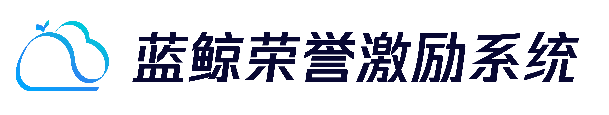

# 蓝鲸荣誉激励系统

---
 
 

简体中文 | [English](readme_en.md)

旨在企业内部提供一套通用的员工荣誉激励解决方案

## 功能
- 支持用户申报奖项、查看申请记录等基础功能
- 支持管理员自定义设置奖项审批流程

## 快速开始
- [本地开发快速指引](docs/dev_guide.md)

## 支持
- [蓝鲸论坛](https://bk.tencent.com/s-mart/community)

## 蓝鲸社区
- [BK-CMDB](https://github.com/Tencent/bk-cmdb)：蓝鲸配置平台（蓝鲸 CMDB）是一个面向资产及应用的企业级配置管理平台。
- [BK-CI](https://github.com/Tencent/bk-ci)：蓝鲸持续集成平台是一个开源的持续集成和持续交付系统，可以轻松将你的研发流程呈现到你面前。
- [BK-BCS](https://github.com/Tencent/bk-bcs)：蓝鲸容器管理平台是以容器技术为基础，为微服务业务提供编排管理的基础服务平台。
- [BK-PaaS](https://github.com/Tencent/bk-paas)：蓝鲸 PaaS 平台是一个开放式的开发平台，让开发者可以方便快捷地创建、开发、部署和管理 SaaS 应用。
- [BK-SOPS](https://github.com/Tencent/bk-sops)：标准运维（SOPS）是通过可视化的图形界面进行任务流程编排和执行的系统，是蓝鲸体系中一款轻量级的调度编排类 SaaS 产品。
- [BK-JOB](https://github.com/Tencent/bk-job)： 蓝鲸作业平台(Job)是一套运维脚本管理系统，具备海量任务并发处理能力。

## 贡献
对于项目感兴趣，想一起贡献并完善项目请参阅 Contributing Guide。

[腾讯开源激励计划](https://opensource.tencent.com/contribution) 鼓励开发者的参与和贡献，期待你的加入。

## 协议

基于 MIT 协议，详细请参考 [LICENSE](LICENSE)
